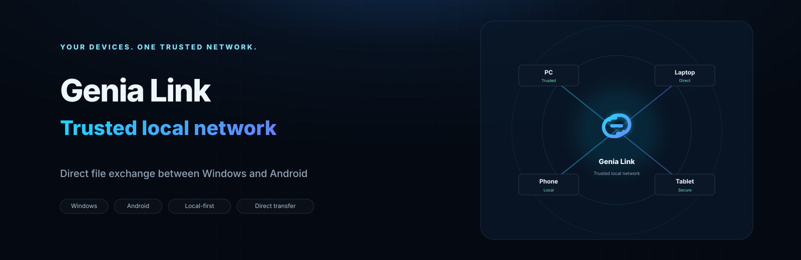

# Genia Link

<p align="center">
  
</p>

<p align="center"><strong>English</strong> · <a href="README.ru.md">Русский</a></p>

<p align="center">
  <a href="https://github.com/geniasoftwin/Genia-Link/actions/workflows/ci.yml"></a>
</p>

Genia Link is a local-first device link for trusted file exchange between Windows and Android devices. The current public source snapshot is **v0.3.1 RC4 / GNP/1 M2.6.2 Authenticated Capabilities**.

> **Development status:** release-candidate / protocol-development checkpoint. Interfaces, packaging, and GNP/1 details may change before a stable release.

## Highlights

- Direct device-to-device transfer on the local IPv4 network.
- Automatic local discovery; no manual IP entry for normal use.
- Explicit SAS pairing and persistent trusted device identity.
- ECDH P-256 key agreement with per-session keys.
- AES-256-GCM protected transfer frames.
- SHA-256 file verification and resumable partial transfers.
- Trusted Identity Registry with authenticated signing-key binding and continuity-verified key rotation.
- Replay-hardened signed identity assertions.
- Local lifecycle states for trusted identities: Active, Retired, and Revoked.
- GNP/1 M2.6.2 authenticated device capability advertisements.
- Windows and Android clients sharing the protocol/core implementation.
- Android optional **Always Ready** mode for long-idle availability.
- No third-party NuGet `PackageReference` dependencies in this source snapshot.

## Current development progress

The public source snapshot on `main` remains **v0.3.1 RC4 / GNP/1 M2.6.2**. Active development has progressed further and is being validated before the next source synchronization.

As of **2026-09-26**:

- **GNP/1 M2.7** — large-batch/concurrent transfer and resume/history UX checkpoint completed in the development line.
- **GNP/1 M2.8.1 Print Service Foundation** — physical end-to-end printing verified: Android → authenticated GNP/1 session → Windows Print Gateway → physical printer.
- **GNP/1 M2.8.2 PDF Printing** — PDF printing verified on a **Samsung SCX-4300 Series**, including a scaling fix that now matches the physical scale of direct Windows printing on the same printer.
- Printing reuses the existing trusted GNP/1 session; no separate unauthenticated print port is introduced.
- `PrinterGateway` discovery does not itself grant trust or print authorization.

See [current development status](docs/DEVELOPMENT_STATUS.md) for the distinction between the public snapshot and newer validated development checkpoints.

## Local-only networking model

Genia Link is designed to transfer user files directly between trusted devices on the local network. The application source does not use HTTP clients, cloud relay APIs, analytics SDKs, advertising SDKs, or external application servers for the transfer path.

Inbound TCP listeners may bind to local interfaces, but accepted peers are restricted by `LocalNetworkPolicy` to IPv4 loopback/private/link-local/shared-local ranges. Trust-sensitive actions additionally require the Genia Link pairing/session authentication model.

Android declares the platform `INTERNET` permission because Android requires it for TCP/UDP networking; this does not imply that Genia Link uses an Internet service.

## Repository layout

```text
src/
  GeniaLink.Core/       Shared protocol, crypto/session, identity and transfer logic
  GeniaLink.Windows/    Windows WPF client
  GeniaLink.Android/    Android client
  GeniaLink.SelfTest/   Offline self-tests
scripts/                Build, publish, install and security-check scripts
docs/                   Protocol, milestone and security documentation
branding/               Project artwork and branding notes
```

## Build prerequisites

The projects target **.NET 10**. Windows builds require the Windows desktop tooling; Android builds require the .NET for Android workload.

For the exact current development workflow and RC4 test notes, see:

- [Development notes (Russian)](docs/DEVELOPMENT_NOTES_RU.md)
- [Protocol notes](docs/PROTOCOL.md)
- [GNP/1 M2.6.2 checkpoint](docs/GNP1_MILESTONE2_6_2_AUTHENTICATED_CAPABILITIES.md)
- [RC4 final test checklist](docs/RC4_FINAL_TEST.md)
- [Security implementation notes](docs/SECURITY_IMPLEMENTATION.md)

## Releases and changelog

Public source snapshot notes are tracked in [CHANGELOG.md](CHANGELOG.md). The current RC4/M2.6.2 snapshot is a pre-release source checkpoint; no release binaries are bundled in the repository.

## Security

Security-sensitive code includes pairing, trusted-session authentication, device/signing identity, key rotation, discovery authenticity/replay handling, transfer framing, resume state, and path confinement.

The development package includes offline self-tests and PowerShell security checks. Before publishing a release build, run the project security checks on the intended Windows/.NET/Android toolchain.

To report a vulnerability, see [SECURITY.md](SECURITY.md). Do not post private keys, credentials, real device identifiers, or exploit details in a public issue.

## Privacy

Genia Link does not require a Genia Link account or cloud relay for file transfer. Operating systems, package managers, GitHub, certificate infrastructure, or future optional features may independently use Internet connectivity outside the Genia Link transfer protocol.

## License and rights

This repository is **source-available for inspection but is not released under an open-source license**. Unless a file or third-party component explicitly states otherwise, project-owned material is All Rights Reserved.

See [LICENSE](LICENSE) and [NOTICE.md](NOTICE.md).

---

**Genia Link** is under active development by Genia Soft.
