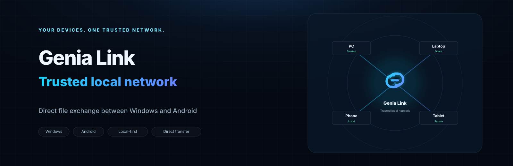
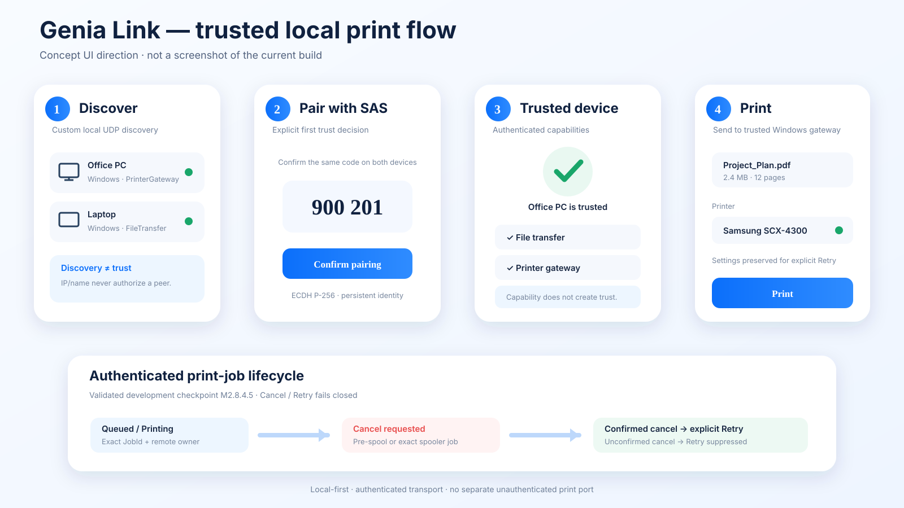

# Genia Link

<p align="center">
  
</p>

<p align="center"><strong>English</strong> · <a href="README.ru.md">Русский</a></p>

<p align="center">
  <a href="https://github.com/geniasoftwin/Genia-Link/actions/workflows/ci.yml"></a>
</p>

<p align="center"><strong>Your Devices. One Connected Ecosystem.</strong></p>

## What is Genia Link?

**Genia Link is a local-first platform for connecting trusted devices and accessing their network services, powered by GNP/1.** It brings Windows and Android devices together for secure file exchange and, in physically tested development builds, remote printing and scanning through another trusted device on the same local network.

**Discover → pair → authenticate → use verified capabilities.** File transfer is part of the public source; printing and scanning have been tested on real hardware but their newer source code has **not** been published in this repository yet.

## Features and availability

| Feature | Status | Validated version |
| --- | --- | --- |
| Windows ↔ Android discovery, SAS pairing, trusted identities and capabilities | **PUBLIC SOURCE** | M2.6.2 |
| Encrypted file transfer with integrity checking and resume | **PUBLIC SOURCE** | M2.6.2 |
| Remote printing via Windows PrinterGateway | **PHYSICAL PASS · DEV BUILD** | M2.8; Samsung SCX-4300 baseline |
| One-page remote scanning via Windows ScannerGateway → Android JPEG | **PHYSICAL PASS · DEV BUILD** | M2.9.2; Windows build7, two Android build8 clients |
| Automatic scan queue, manual screen-lock/background scan, ADF/multipage/PDF | **NOT VALIDATED** | Future work, not in public source |

**PUBLIC SOURCE** = currently available source code on \`main\`. **PHYSICAL PASS** = a specific scenario tested on real devices in a separate development build, not a downloadable release. See the [Validation Matrix](docs/VALIDATION_MATRIX.md) and [Development Status](docs/DEVELOPMENT_STATUS.md).

## Download and quick start

- **Public source release:** [v0.3.1 RC4 / GNP/1 M2.6.2](https://github.com/geniasoftwin/Genia-Link/releases/tag/v0.3.1-rc4-m2.6.2) — a **source checkpoint only**, with no attached EXE or APK installers.
- **Build it:** requires **.NET 10** and the appropriate Windows Desktop / .NET for Android toolchains. See [build prerequisites](#build-prerequisites), the \`scripts/\` folder, and the [RC4 checklist](docs/RC4_FINAL_TEST.md).
- **Connect:** launch the two clients on the same local network, discover the peer, compare and confirm the pairing code on both devices, then transfer files. See [User Flow](docs/USER_FLOW.md).
- **Printing and scanning:** the tested development Windows gateway relies on locally installed printer/scanner drivers. These newer builds are **not included in the public M2.6.2 release**.

This repository is **source-available, All Rights Reserved**, not open-source licensed; see [LICENSE](LICENSE).

## Screenshots and demo

Real Windows and Android screenshots, plus a physical print/scan demo, will be added after checking for private documents, device identifiers and network details. The illustration below is clearly **concept UI**, not a screenshot of a shipped build.

## Product flow — concept illustration

> **Concept UI:** the visual below shows the intended information hierarchy and user journey. It is **not a screenshot of the current build**. Implementation/validation status is documented separately so concept visuals are never presented as shipped behavior.

<p align="center">
  
</p>

**Discover → pair with SAS → authenticate the trusted device → see verified capabilities → transfer files or, in tested development builds, print and scan remotely.**

See the [User Flow](docs/USER_FLOW.md) for the step-by-step explanation and the [Validation & Compatibility Matrix](docs/VALIDATION_MATRIX.md) for a clear distinction between **PUBLIC**, **PHYSICAL PASS**, **IMPLEMENTED / NOT PHYSICALLY VALIDATED**, and **PLANNED** behavior.

## Latest development checkpoint — GNP/1 M2.9.2 Remote Scan build8 (physical PASS 2026-10-10)

Remote scanning is now physically validated on a **trusted Windows ScannerGateway (build7)** and **two Android clients (build8)** over the existing authenticated local GNP/1 transport. The physical test confirmed:

- Repeated one-page 300 dpi WIA acquisitions, bounded BMP-to-JPEG normalization, and verified JPEG receipt on Android.
- Exclusive scanner access with a typed `Busy` response when a second trusted phone requests an already-busy scanner.
- Clear Android “scanner busy” UI, and subsequent successful scans for each phone once the scanner becomes available.
- Active Android scan keeps the display on even with the system screen timeout set to **15 or 30 seconds**.

**Limitations:** manual screen lock/background execution, an automatic scanner job queue, explicit scan cancellation, multipage/ADF, and PDF output are **not validated** by this checkpoint. A full M2.9.2 security/build gate is not claimed by the physical tests.

See [M2.9.2 Remote Scan physical validation checkpoint](docs/GNP1_M2_9_2_REMOTE_SCAN_BUILD8.md) and [Validation Matrix](docs/VALIDATION_MATRIX.md).

## Earlier print checkpoint — GNP/1 M2.8.4.5 Cancel / Retry (physically validated 2026-10-06)

Genia Link development has advanced beyond the older public M2.6.2 source snapshot. An earlier tested package was **v0.3.1 RC4 · GNP/1 M2.8.4.5 Cancel / Retry**.

Validated on the Android → trusted Windows gateway → Samsung SCX-4300 path:
- authenticated remote printer discovery and print submission;
- explicit authenticated Cancel / Retry with JobId + authenticated-device ownership;
- pre-spool cancellation for JPG/PNG image jobs and PDF jobs;
- DOCX cancellation during Office preparation and inside a full 3000 ms post-preparation pre-spool window;
- repeated **Cancel → Retry → Cancel** cycles with preserved document and print settings;
- fail-closed late cancellation: when the exact spooler job can no longer be proven, cancellation is not confirmed and retry is suppressed;
- conservative M2.8.4.4 lifecycle semantics remain intact for legacy drivers that remove jobs before physical completion can be proven;
- Windows and Android security/build gates passed on the target toolchain, including the M2.8.4.5 fix7/fix8 checks.

See [M2.8.4.5 Cancel / Retry checkpoint](docs/GNP1_MILESTONE2_8_4_5_CANCEL_RETRY.md) and [current development status](docs/DEVELOPMENT_STATUS.md).

The M2.8.4.5 print milestone remains a validated historical checkpoint; the later Remote Scan checkpoint is documented above.

> Repository note: this update records the physically validated development state. The public source tree on `main` remains the older M2.6.2 snapshot until a deliberate full source synchronization is prepared and revalidated as a whole.

## Highlights

- Direct device-to-device transfer on the local IPv4 network.
- Automatic local discovery over custom UDP 47502, plus authenticated remembered-route recovery for trusted sleeping peers; remembered IP addresses never establish trust.
- Explicit SAS pairing and persistent trusted device identity.
- ECDH P-256 key agreement with per-session keys.
- AES-256-GCM protected transfer frames.
- SHA-256 file verification and resumable partial transfers.
- Trusted Identity Registry with authenticated signing-key binding and continuity-verified key rotation.
- Replay-hardened signed identity assertions.
- Local lifecycle states for trusted identities: Active, Retired, and Revoked.
- GNP/1 M2.6.2 authenticated device capability advertisements.
- Windows and Android clients sharing the protocol/core implementation.
- Android optional **Always Ready** mode for long-idle availability.
- No third-party NuGet `PackageReference` dependencies in this source snapshot.

## Current development progress

The public source snapshot on `main` remains **v0.3.1 RC4 / GNP/1 M2.6.2**. Active development has progressed further and is being validated before the next source synchronization.

As of **2026-10-10**:

- **GNP/1 M2.7** — large-batch/concurrent transfer and resume/history UX checkpoint completed in the development line.
- **GNP/1 M2.8.1 Print Service Foundation** — physical end-to-end printing verified: Android → authenticated GNP/1 session → Windows Print Gateway → physical printer.
- **GNP/1 M2.8.2 PDF Printing** — PDF printing verified on a **Samsung SCX-4300 Series**, including a scaling fix that now matches the physical scale of direct Windows printing on the same printer.
- **GNP/1 M2.8.3 Windows Remote Print Client** — physical Windows → authenticated GNP/1 → Windows Print Gateway → Samsung SCX-4300 printing verified; image `ActualSize` was also checked with a 50 × 50 mm calibration target and matched direct Windows printing.
- **GNP/1 M2.8.4 Office Document Print Bridge** — Microsoft Office path is physically validated for macro-free Office documents; LibreOffice/OpenOffice fallback remains implemented but is not yet physically validated.
- **GNP/1 M2.8.4.3 TXT backend** — physically validated with UTF-8, real TAB stops, wrapping and multi-page pagination.
- **GNP/1 M2.8.4.4 Lifecycle / Error Recovery** — physically validated with conservative completion semantics and fix23 Android notification cleanup.
- **GNP/1 M2.8.4.5 Cancel / Retry** — **physical + security PASS**: early pre-spool cancellation for image/PDF, Office preparation-aware DOCX cancellation, explicit retry with preserved settings, and fail-closed late cancellation.
- **GNP/1 M2.9.2 Remote Scan build8** — **physical PASS**: two trusted Android clients use the Windows build7 ScannerGateway; exclusive WIA acquisition and `Busy` UX, verified single-page JPEG results, Android display stays on during scanning at 15/30 s screen timeouts. Not a public-source or full security-gate claim.
- Printing reuses the existing trusted GNP/1 session; no separate unauthenticated print port is introduced.
- `PrinterGateway` discovery does not itself grant trust or print authorization.

See [current development status](docs/DEVELOPMENT_STATUS.md) for the distinction between the public snapshot and newer validated development checkpoints.

## Engineering principle: minimal mandatory dependencies

Genia Link prefers **minimal mandatory dependencies**: core local capabilities should not require unrelated helper applications, third-party accounts or cloud services when they can reasonably be implemented safely and maintainably inside the product or through the target OS. Optional integrations may improve fidelity or compatibility without becoming the only path to the feature.

See [Product & Dependency Principles](docs/PRODUCT_PRINCIPLES.md).

## Local-only networking model

Genia Link is designed to transfer user files directly between trusted devices on the local network. The application source does not use HTTP clients, cloud relay APIs, analytics SDKs, advertising SDKs, or external application servers for the transfer path.

Inbound TCP listeners may bind to local interfaces, but accepted peers are restricted by `LocalNetworkPolicy` to IPv4 loopback/private/link-local/shared-local ranges. Trust-sensitive actions additionally require the Genia Link pairing/session authentication model.

Android declares the platform `INTERNET` permission because Android requires it for TCP/UDP networking; this does not imply that Genia Link uses an Internet service.

Genia Link does not depend on mDNS or SSDP for its normal discovery path. It uses its own bounded UDP discovery on port 47502. For an already trusted sleeping peer, the last cryptographically confirmed LAN endpoint may be retained as a route hint; the peer must still authenticate as the expected DeviceId before any trusted operation proceeds.

## Repository layout

```text
src/
  GeniaLink.Core/       Shared protocol, crypto/session, identity and transfer logic
  GeniaLink.Windows/    Windows WPF client
  GeniaLink.Android/    Android client
  GeniaLink.SelfTest/   Offline self-tests
scripts/                Build, publish, install and security-check scripts
docs/                   Protocol, milestone and security documentation
branding/               Project artwork and branding notes
```

## Build prerequisites

The projects target **.NET 10**. Windows builds require the Windows desktop tooling; Android builds require the .NET for Android workload.

For the exact current development workflow and RC4 test notes, see:

- [Architecture overview](docs/ARCHITECTURE.md)
- [GNP/1 Specification](docs/GNP1_SPEC.md)
- [GNP/1 deterministic test vectors](docs/GNP1_TEST_VECTORS.md)
- [Threat model](docs/THREAT_MODEL.md)
- [Development notes (Russian)](docs/DEVELOPMENT_NOTES_RU.md)
- [Protocol notes](docs/PROTOCOL.md)
- [GNP/1 M2.6.2 checkpoint](docs/GNP1_MILESTONE2_6_2_AUTHENTICATED_CAPABILITIES.md)
- [RC4 final test checklist](docs/RC4_FINAL_TEST.md)
- [Security implementation notes](docs/SECURITY_IMPLEMENTATION.md)
- [M2.8.4.5 Cancel / Retry checkpoint](docs/GNP1_MILESTONE2_8_4_5_CANCEL_RETRY.md)
- [M2.9.2 Remote Scan build8 physical checkpoint](docs/GNP1_M2_9_2_REMOTE_SCAN_BUILD8.md)

## Releases and changelog

Public source snapshot notes are tracked in [CHANGELOG.md](CHANGELOG.md). The current RC4/M2.6.2 snapshot is a pre-release source checkpoint; no release binaries are bundled in the repository.

## Security

Security-sensitive code includes pairing, trusted-session authentication, device/signing identity, key rotation, discovery authenticity/replay handling, transfer framing, resume state, and path confinement.

The development package includes offline self-tests and PowerShell security checks. Before publishing a release build, run the project security checks on the intended Windows/.NET/Android toolchain.

To report a vulnerability, see [SECURITY.md](SECURITY.md). Do not post private keys, credentials, real device identifiers, or exploit details in a public issue.

## Privacy

Genia Link does not require a Genia Link account or cloud relay for file transfer. Operating systems, package managers, GitHub, certificate infrastructure, or future optional features may independently use Internet connectivity outside the Genia Link transfer protocol.

## License and rights

This repository is **source-available for inspection but is not released under an open-source license**. Unless a file or third-party component explicitly states otherwise, project-owned material is All Rights Reserved.

See [LICENSE](LICENSE) and [NOTICE.md](NOTICE.md).

---

**Genia Link** is under active development by Genia Soft.
