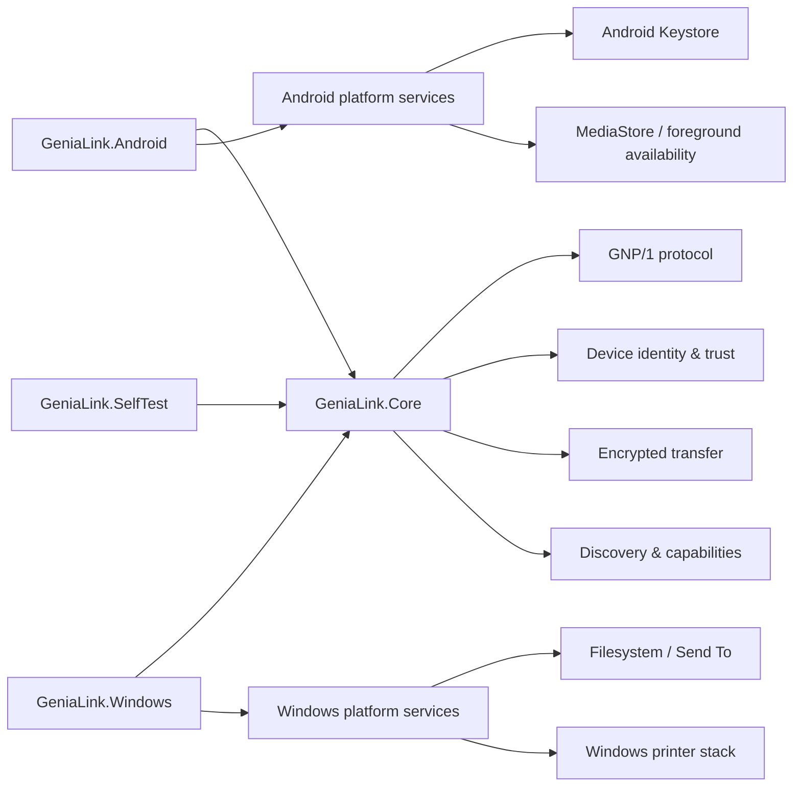

# Genia Link Architecture

_Last updated: 2026-10-07_

This document gives a public high-level view of the Genia Link architecture and trust boundaries.

> **Publication boundary:** the source tree currently published on `main` is **v0.3.1 RC4 / GNP/1 M2.6.2**. Newer M2.7/M2.8 behavior described in development checkpoint documents has been physically validated in the development line but is not yet fully synchronized into the public source tree.

## Design goals

Genia Link is designed around five constraints:

1. **Local-first transport** — normal transfer and service traffic stays on the local IPv4 network.
2. **Cryptographic device identity** — trust is bound to persistent device keys, not IP addresses or display names.
3. **Explicit first trust** — initial pairing uses a user-verified SAS.
4. **Capability-based services** — file transfer, PrinterGateway and later services are enabled only when the authenticated peer advertises the required capability.
5. **Fail-closed behavior** — uncertainty must not silently become authorization, successful cancellation, or successful physical completion.

## Component model



### `GeniaLink.Core`

Shared protocol and security logic lives in the common core so Windows and Android do not maintain separate interpretations of the same trust and transfer rules.

The core owns concepts such as:

- protocol framing and bounded message parsing;
- persistent device identity metadata;
- trusted-session authentication;
- secure-channel framing;
- transfer offer/resume/integrity rules;
- signed discovery and capability assertions;
- trust lifecycle and replay protection.

### Windows client

The Windows application provides the desktop UI and Windows-specific integrations. Depending on the development checkpoint, these include local file handling, Send To integration and the Windows Print Gateway.

Windows private key material is kept through the Windows cryptographic platform rather than being stored as raw private-key bytes in application JSON.

### Android client

The Android application shares the GNP/1/core implementation and provides Android-specific UI, sharing integration, foreground availability and Keystore-backed private keys.

The Android `INTERNET` permission is required by the platform for TCP/UDP sockets; it is not evidence of a Genia Link cloud service.

### Self-test / security tooling

`GeniaLink.SelfTest` and the PowerShell security-check scripts exercise protocol, identity, path-safety and build invariants offline. Development checkpoints are not marked complete solely because code compiles; the M2.8 print line is additionally tested on real hardware.

## Network endpoints

Current GNP/1 endpoints are fixed and local-network scoped:

| Endpoint | Purpose |
| --- | --- |
| TCP 47500 | Authenticated trusted transport and file/service commands |
| TCP 47501 | Initial pairing |
| UDP 47502 | Local discovery |
| TCP 47503 | Authenticated signing-identity binding / continuity |

Accepted network addresses are additionally constrained by `LocalNetworkPolicy`.

## Discovery is not trust

Discovery is intentionally separated from authorization.

A UDP advertisement can make a device visible, but visibility does not make the peer trusted. Signed discovery improves authenticity and replay resistance for already known identities, while actual trusted operations still require the persistent trust relationship and authenticated session.

### Sleeping peers and route recovery

Normal discovery uses UDP 47502. For already trusted devices, Genia Link can retain the last **cryptographically confirmed** local endpoint as a route hint. That allows a sleeping peer to remain usable even when mobile power management suppresses frequent discovery broadcasts.

The remembered IP address is never a trust anchor. A connection must still prove the expected DeviceId/key relationship through the trusted-session handshake. If DHCP has reassigned the address, the connection fails rather than sending data to the new host.

There is currently no claim that manual IP entry is required for normal use.

## Trusted transfer path

The normal file-transfer path is:

```text
discover / restore trusted route
          ↓
trusted-session authentication
          ↓
Hello / HelloAck
          ↓
FileOffer (name, path, size, SHA-256)
          ↓
FileAccept (+ optional safe resume offset)
          ↓
encrypted FileChunk frames
          ↓
FileComplete
          ↓
full-size + SHA-256 verification
          ↓
atomic/bounded local publication
```

Resume data is scoped to the trusted relationship and does not bypass final integrity verification.

## Print-service development line

The M2.8 development line adds printing as an authenticated service over the existing trusted transport rather than exposing a separate unauthenticated print listener.

The validated M2.8.4.5 checkpoint includes:

- authenticated printer discovery;
- image, PDF, TXT and Office document print paths;
- conservative Windows spooler lifecycle observation;
- explicit authenticated Cancel / Retry;
- job ownership bound to JobId + authenticated remote device;
- bounded pre-spool cancellation;
- fail-closed late cancellation when the exact Windows job can no longer be proven.

The legacy Samsung SCX-4300 is used as a conservative physical baseline. When its driver cannot prove physical completion, Genia Link does not synthesize a successful completion state.

See [M2.8.4.5 Cancel / Retry](GNP1_MILESTONE2_8_4_5_CANCEL_RETRY.md).

## Capability model

Capabilities describe what an authenticated device is prepared to provide. They are not trust grants.

A peer may advertise capabilities such as trusted discovery, trusted transport, file transfer, shared resources or PrinterGateway. The receiver accepts capability state only when the packet is cryptographically consistent with an already trusted active identity.

This model is intended to keep future services additive rather than weakening the base transfer/trust contract.

## Dependency policy

Genia Link follows a **minimal mandatory dependency** principle.

Core advertised capabilities should not depend on separately installed helper products, third-party accounts or cloud services when the same function can reasonably be implemented safely, locally and maintainably inside the product or through the target operating system.

Optional integrations may improve fidelity or compatibility, but they should enhance the baseline rather than define it. For example, Microsoft Office may remain an optional high-fidelity renderer for Office documents while a future self-contained document engine provides the baseline path for a Pro-class edition.

See [Product & Dependency Principles](PRODUCT_PRINCIPLES.md).

## Compatibility strategy

GNP/1 development favors additive extensions and explicit capability negotiation where possible. Older peers should not gain authority simply because a newer peer understands more message types.

Security-sensitive compatibility rules fail closed: unknown authority, identity mismatch, stale/replayed assertions, ambiguous print-job correlation or unsafe paths are rejected rather than guessed.

## Related documents

- [Product & Dependency Principles](PRODUCT_PRINCIPLES.md)
- [Protocol notes](PROTOCOL.md)
- [Threat model](THREAT_MODEL.md)
- [Security implementation notes](SECURITY_IMPLEMENTATION.md)
- [Development status](DEVELOPMENT_STATUS.md)
- [M2.8.4.5 Cancel / Retry checkpoint](GNP1_MILESTONE2_8_4_5_CANCEL_RETRY.md)
