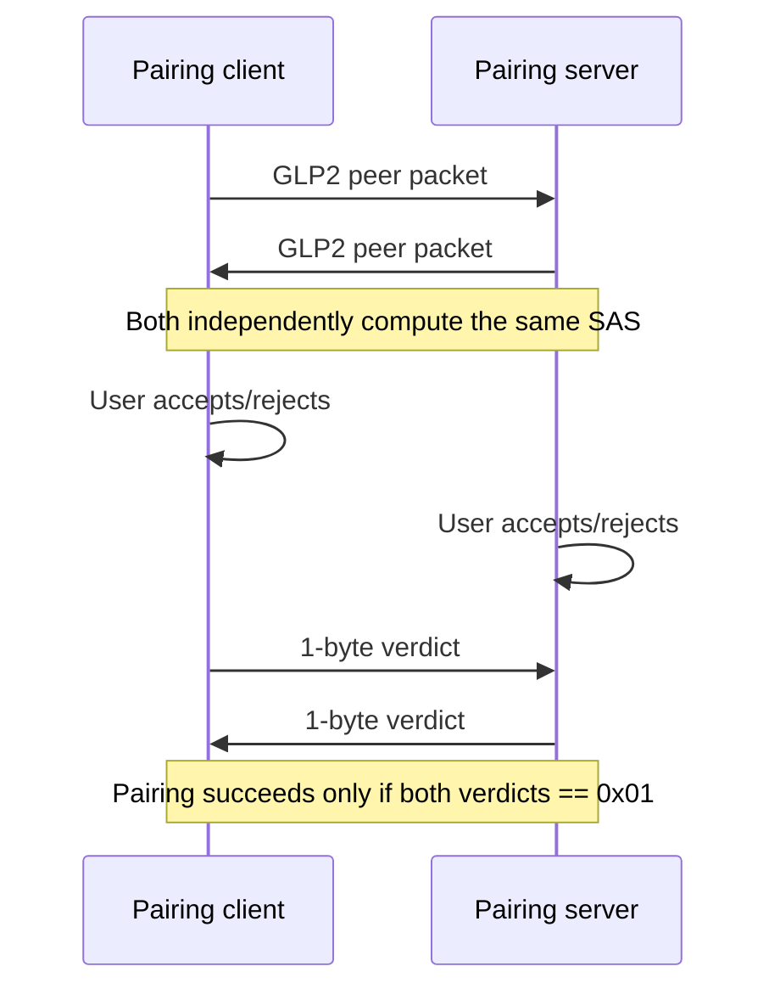
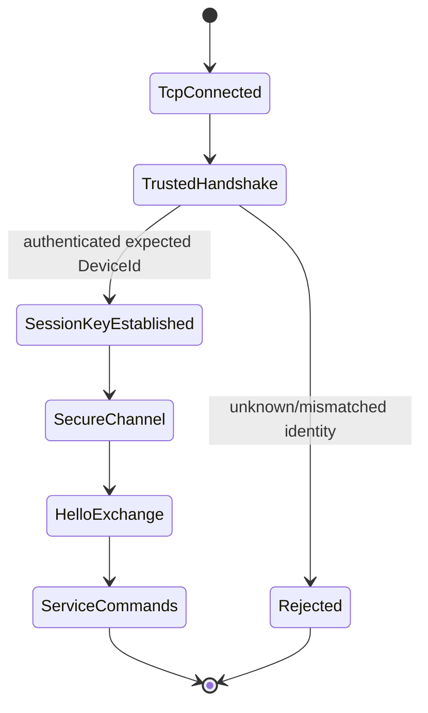
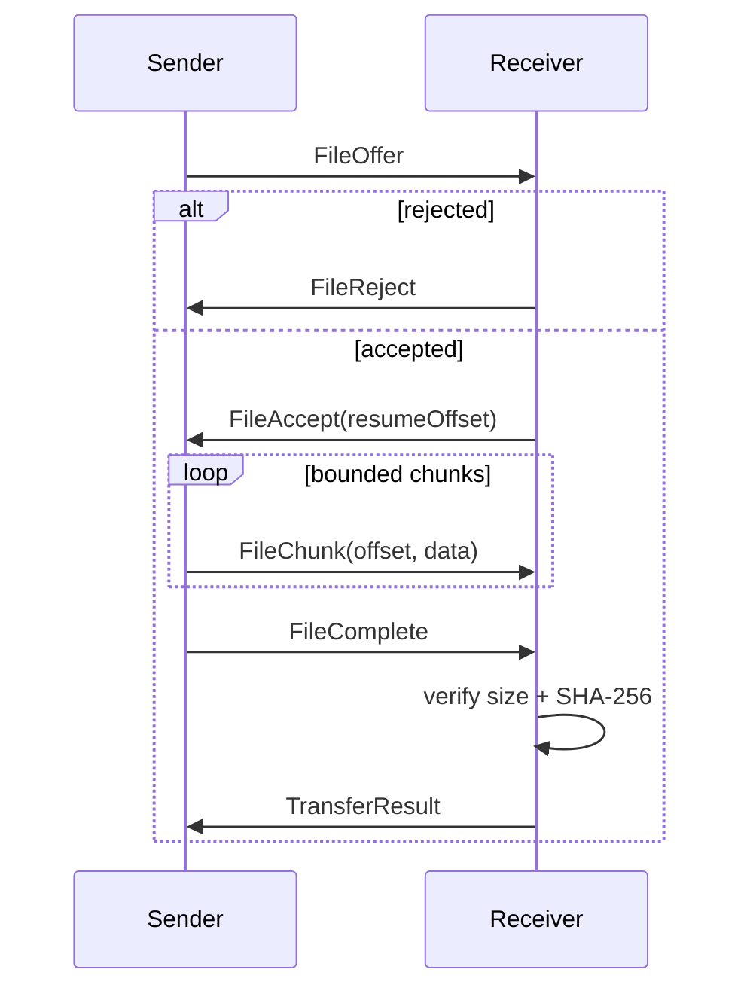

# GNP/1 Specification — Public Draft 0.1

_Status: working public specification · 2026-10-07_

This document describes the public GNP/1 protocol contract implemented by the currently published Genia Link source snapshot and separates that contract from newer development-only extensions.

> **Publication boundary:** the source tree on `main` currently corresponds to **v0.3.1 RC4 / GNP/1 M2.6.2**. M2.7/M2.8 checkpoints are documented publicly but their complete source tree is not yet synchronized to `main`.

## 1. Conformance language

The key words **MUST**, **MUST NOT**, **SHOULD**, **SHOULD NOT**, and **MAY** are used as normative requirements in this document.

An implementation claiming compatibility with a section marked **byte-level normative** MUST reproduce the documented bytes and validation rules.

Sections marked **state-machine normative** define required ordering, trust and failure behavior while the public draft still relies on the reference implementation for some exact internal field encodings.

## 2. Design principles

GNP/1 is a local-first trusted-device protocol.

A conforming implementation MUST keep these concepts separate:

- **discovery** — locating a possible peer;
- **identity** — persistent cryptographic device identity;
- **trust** — an explicit local decision anchored by pairing;
- **authentication** — proving the expected trusted identity for a session;
- **capability** — an authenticated statement about a service the peer provides;
- **authorization** — local policy deciding whether an authenticated trusted peer may use a service.

Discovery alone MUST NOT grant trust or service authorization.

## 3. Network endpoints

The public M2.6.2 constants are:

| Transport | Port | Purpose |
| --- | ---: | --- |
| TCP | 47500 | trusted transport / file and authenticated service commands |
| TCP | 47501 | initial pairing |
| UDP | 47502 | local discovery |
| TCP | 47503 | authenticated signing-identity binding / continuity |

Protocol version: **3**.

Current public safety constants include:

| Constant | Value |
| --- | ---: |
| MaxChunkSize | 256 KiB |
| MaxEncryptedFrameSize | MaxChunkSize + 8192 bytes |
| MaxFileSize | 100 GiB |
| MaxBatchFiles | 10,000 |
| MaxPreviewBytes | 192 KiB |
| MaxTextPreviewBytes | 64 KiB |
| MaxRelativeDirectoryCharacters | 2048 |
| MaxRelativeDirectoryDepth | 64 |
| FreeSpaceReserveBytes | 64 MiB |
| HandshakeTimeout | 15 s |
| PairingTimeout | 2 min |
| IdleTimeout | 30 s |
| TransferIoTimeout | 30 s |
| VerificationTimeout | 10 min |
| DiscoveryInterval | 2 s |
| DiscoveryExpiry | 8 s |
| PartialRetention | 7 days |

Accepted addresses are additionally restricted by the implementation's local-network policy.

## 4. Primitive encodings

### 4.1 Integer byte order

Where a field is explicitly documented as a 32-bit integer in the byte-level pairing format, it is encoded as signed **big-endian Int32**.

### 4.2 UUID / DeviceId

The public .NET reference implementation serializes pairing DeviceId using `Guid.TryWriteBytes(Span<byte>)` into exactly 16 bytes.

Cross-language implementations MUST reproduce the same byte representation when computing pairing vectors or parsing the byte-level pairing packet.

### 4.3 Text

Pairing device names use strict UTF-8:

- malformed UTF-8 MUST be rejected;
- empty/whitespace-only names MUST be rejected;
- control characters and Unicode format characters MUST be rejected;
- pairing name length is bounded to 160 UTF-8 bytes.

### 4.4 Public keys

Pairing ECDH public keys:

- MUST be NIST P-256;
- MUST be encoded as DER SubjectPublicKeyInfo;
- MUST be between 32 and 256 bytes in the pairing packet.

Signing public keys:

- MUST be ECDSA P-256;
- use DER SubjectPublicKeyInfo.

### 4.5 Hashes and signatures

GNP/1 public identity rules use SHA-256.

Signing Key ID is:

```text
UPPERCASE_HEX(SHA256(SigningPublicKeySubjectPublicKeyInfo))
```

ECDSA signatures use:

- ECDSA P-256;
- SHA-256;
- RFC 3279 DER sequence encoding;
- current public validation rejects empty signatures and signatures larger than 80 bytes.

## 5. Pairing — byte-level normative

Pairing uses TCP 47501.

### 5.1 Client/server ordering



A device MUST reject self-pairing where local and remote DeviceId are identical.

### 5.2 GLP2 peer packet

The packet is:

| Field | Size | Encoding |
| --- | ---: | --- |
| Magic | 4 | ASCII `GLP2` |
| Version | 4 | Int32 big-endian; MUST equal 3 |
| DeviceId | 16 | reference Guid byte representation |
| DeviceNameLength | 4 | Int32 big-endian |
| DeviceName | variable | strict UTF-8 |
| PublicKeyLength | 4 | Int32 big-endian |
| PublicKey | variable | DER SubjectPublicKeyInfo, ECDH P-256 |

Validation is fail-closed. Invalid magic, version, name length, UTF-8, unsafe device name, key length, non-P-256 key or malformed SPKI MUST reject pairing.

### 5.3 SAS computation

The SAS context is the ASCII byte string:

```text
GENIALINK-PAIR-SAS-V2
```

Let the two peers be ordered by DeviceId using the reference ordering used by `Guid.CompareTo`; call them Left and Right.

Construct:

```text
SAS_INPUT =
    ASCII("GENIALINK-PAIR-SAS-V2")
    || Left.DeviceId[16]
    || Left.PublicKeySPKI
    || Right.DeviceId[16]
    || Right.PublicKeySPKI
```

Then:

```text
H = SHA256(SAS_INPUT)
N = BIG_ENDIAN_UINT32(H[0..3]) mod 1,000,000
SAS = decimal N padded to 6 digits and displayed as "DDD DDD"
```

Both peers MUST display the same SAS and pairing MUST complete only after both users accept.

### 5.4 Pairing fingerprint

The pairing UI fingerprint is:

```text
UPPERCASE_HEX(SHA256(PublicKeySPKI)[0..15])
```

That is the first 16 bytes (128 bits) of SHA-256, shown as uppercase hexadecimal.

## 6. Trust and persistent identity — state-machine normative

Successful pairing creates a persistent local trust relationship.

A remembered IP address, hostname, device alias or UDP advertisement MUST NOT replace the cryptographic trust anchor.

A trusted operation MUST authenticate the expected remote identity before protected commands are processed.

Administrative lifecycle and cryptographic trust are separate dimensions. The development line uses local Active / Retired / Revoked lifecycle semantics; inactive/revoked identities are not silently reactivated by discovery.

## 7. Trusted-session state machine — state-machine normative

The public reference implementation establishes a trusted session before protected transport.

Conceptually:



A server MUST NOT process trusted service commands merely because a TCP connection originated from a remembered address.

The reference self-test requires client and server to derive the same session key for the authenticated trusted relationship.

## 8. Secure channel — state-machine normative

Protected frames use AES-256-GCM under a per-session key.

Required behavior:

- confidentiality and integrity are provided by authenticated encryption;
- modified ciphertext MUST be rejected;
- replayed protected frames MUST be rejected;
- frame sizes MUST remain bounded by implementation limits;
- authentication failure MUST terminate/reject the affected protected operation rather than returning unauthenticated payload.

The exact byte-level secure-frame layout remains reference-implementation-defined in Public Draft 0.1 and will be lifted into this specification when the full current source synchronization is published.

## 9. File transfer state machine

After trusted-session authentication and Hello/HelloAck, the v3 file-transfer flow is:



A FileOffer includes at least:

- random TransferId;
- safe FileName;
- safe normalized relative directory;
- FileSize;
- SHA-256 of the complete file.

Receiver requirements:

- resume offset MUST NOT be treated as integrity proof;
- chunks MUST be sequential and MUST NOT exceed declared size;
- final size and full SHA-256 MUST match before publication;
- destination path confinement MUST be enforced;
- unsafe traversal/reparse escape MUST be rejected.

## 10. Resume identity

The current documented resume identity derives from:

- complete file hash;
- big-endian size;
- normalized relative directory;
- separator;
- file name;

and is additionally scoped by remote DeviceId + current trust relationship in the replay/lifecycle-hardened line.

Partial data is retained only for a bounded lifetime and is still included in final integrity verification.

## 11. Discovery and signed assertions

GNP/1 discovery is custom UDP on port 47502, not mDNS/SSDP.

The development history includes additive envelopes:

- `GLD2` — legacy compatibility discovery;
- `GLS1` — self-signed discovery;
- `GLS2` — replay-protected signed identity assertion;
- `GLC1` — authenticated capability advertisement for already trusted identities.

A mathematically valid self-signature from an unknown device MUST NOT create trust.

### 11.1 Replay ordering

For an already pinned identity, lower signed identity/capability revisions are rejected as replay/rollback. Same-revision conflicting assertions are rejected.

### 11.2 Capability rule

Capabilities are authenticated statements, not trust grants.

An advertised capability set may be persisted only when the packet is consistent with the already trusted active ECDH/signing identity and satisfies the current capability-validation rules.

## 12. Signing-identity continuity

The signing identity uses ECDSA P-256 independently from the ECDH pairing key.

The M2.4.2 continuity model requires intentional signing-key rotation to advance generation exactly N → N+1 and be proven by a certificate signed by the immediately previous signing key.

A larger generation number without valid continuity proof MUST NOT replace an already pinned signing key.

## 13. Error handling

Security-sensitive parsing is fail-closed.

A conforming implementation MUST reject, rather than guess, at least:

- malformed lengths;
- invalid UTF-8 where strict UTF-8 is required;
- unsupported protocol version in pairing;
- invalid curve/key encoding;
- signature failure;
- replay/rollback assertion;
- unknown required capability bits;
- unsafe path traversal;
- encrypted-frame authentication failure;
- ambiguous privileged object correlation.

## 14. Development-only print extension boundary

The physically validated M2.8.4.5 development line adds printing over the authenticated trusted transport.

Documented development message IDs include:

| ID | Development message |
| ---: | --- |
| 67 | PrintJobStatus |
| 68 | PrintJobOfferV5 |
| 69 | PrintJobCancelRequest |
| 70 | PrintJobCancelResult |

These IDs are recorded for development continuity but are **not yet claimed as part of the M2.6.2 public source snapshot**.

The validated development contract binds cancellation to JobId + authenticated remote DeviceId and fails closed when the exact Windows spooler job can no longer be proven.

## 15. Conformance tests

A public implementation SHOULD run the vectors in [GNP/1 Test Vectors](GNP1_TEST_VECTORS.md).

The Genia Link reference self-test additionally covers:

- unsafe filename/path rejection;
- transfer/resume round-trip;
- signed discovery verification and tamper detection;
- replay-protected assertion handling;
- capability assertion validation;
- signing-key rotation continuity;
- local-only network policy;
- ECDH compatibility;
- pairing SAS equality;
- trusted-session session-key equality;
- encrypted-channel round-trip;
- encrypted-frame tamper rejection;
- encrypted-frame replay rejection.

## 16. Specification roadmap

Public Draft 0.1 intentionally does not invent undocumented byte layouts.

Next spec revisions should lift the remaining reference implementation into explicit byte-level tables for:

1. trusted-session handshake;
2. secure-channel frame layout / nonce and sequence construction;
3. base MessageType registry and payload schemas;
4. GLD2/GLS1/GLS2/GLC1 byte layouts;
5. identity-binding GLI1/GLI2/GLR1 byte layouts;
6. transfer/browse/preview payload encodings.

This draft therefore improves external reproducibility now while preserving the rule: **unknown details are documented as unknown, not guessed.**
